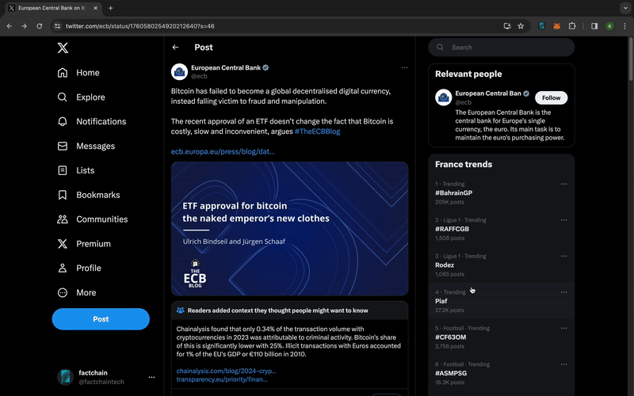

Getting Started
<ul class='container' style='display list-item;'>
<li>
    <a href="https://chromewebstore.google.com/detail/factchain-community/emgjjedibkjlocjmcjgkeolfkbcicbpl">Download the Factchain browser extension</a> (compatible with Chrome and Brave).
</li>
<li>
    <a href="https://chromewebstore.google.com/detail/metamask/nkbihfbeogaeaoehlefnkodbefgpgknn?hl=fr">Install MetaMask</a>  (support for more wallets will follow).
</li>
<li>
    Create a Sepolia account. (Factchain is currently available on testnet. Mainnet launch will be announced soon).
</li>
<li>
    Get some test ETH <a href="https://sepoliafaucet.com/">here</a> or mine some <a href=" https://sepolia-faucet.pk910.de/">here</a>.
</li>
<li>
    Explore <a href="https://twitter.com/home">X</a> and stay tuned for more platforms (<a href="https://warpcast.com/factchain">Warpcast</a>, <a href="https://www.youtube.com/">Youtube</a>, etc.).
</li>
<li>
    Enjoy an enriched social network experience with community notes.
</li>
</ul>
 

 