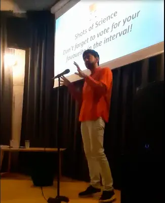
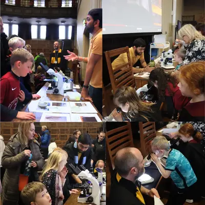
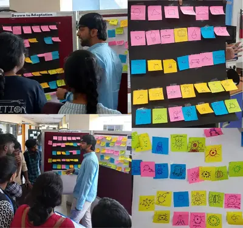

# My Science Communication Journey

## Shots of Science Talk
*17 November 2023*

<figure></figure>

A 3 min talk to an audience of the public as part of the larger Shots of Science event. Jumping genes are powerful hitchhikers that inhabit the DNA of all walks of life from microbes to humans. These rogue elements have the remarkable ability to rewire bacterial genomes providing boosts and superpowers to their hosts. Join me on this journey to unravel the secrets of these miniature genetic adventurers showcasing their quest for survival and self-interest within the world of bacteria. They are just short stretches of DNA, but they can do so much! It's a story of intrigue, innovation, and evolution that's sure to leave you astounded by the tiny but mighty inhabitants of the bacterial world.
 

## VG&M Harry Potter Themed Outreach Event for School Children
*28 October 2023*

<figure></figure>

We discussed with the audience of school children about the diversity of microbes in our environment  and all the places they are found from our hands, to the TV set to our stomach. We talked about the importance of the ‘good’ microbes and the risks of the ‘bad’ ones. We had cultured plates of swabs from various places that were Harry Potter themed ex: “Mr. Weasley's Car”. We had microscopes focusing on drops of puddle water showcasing protozoa, cyanobacteria and algal diversity.
 

## IISc Open Day Event Discussing How Complexity Arises by Simple Adaptations 
*4th March 2023*

<figure></figure>

We talked about how complexity emerges without a plan by means of simple adaptations to existing environments that stack over time. We played a game where people were asked to add one feature to a ‘blob’ creature to make it better adapted for a given environment. Further people would make modifications to previously modified blobs, adding one feature at a time – there clearly is no plan because different people are adding features. But just by focusing on the current environment and using the existing modifications as reference, you get more complex features. Features that were once important are repurposed into something new. You also see convergent evolution where the same feature arises from different precursors.

